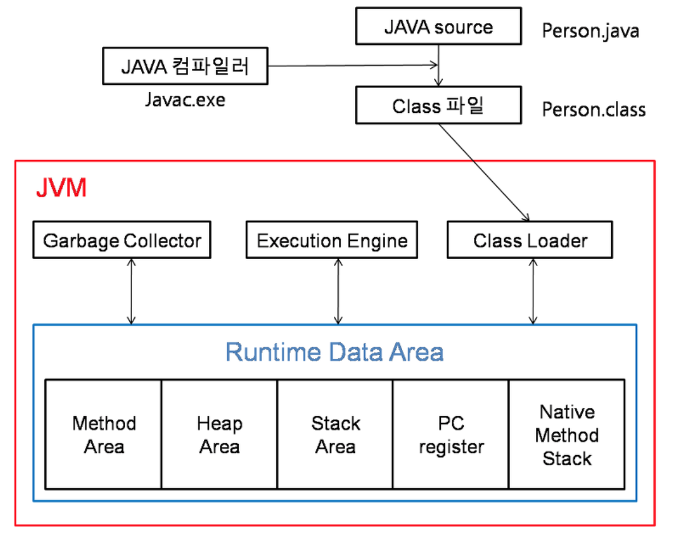

JVM(Java Virtual Machine) 이란?
===
자바 가상 머신의 약자로 자바 바이트 코드(Class 파일)를 실행할 수 있는 주체이다.
> https://ko.wikipedia.org/wiki/%EC%9E%90%EB%B0%94_%EA%B0%80%EC%83%81_%EB%A8%B8%EC%8B%A0

JVM의구조
===

- 자바 [컴파일러](https://ko.wikipedia.org/wiki/%EC%BB%B4%ED%8C%8C%EC%9D%BC%EB%9F%AC)
  - 자바 파일을 클래스 파일(바이트 코드)로 변환하는 프로그램.
- 클래스 로더
  - 컴파일된 클래스 파일을 메모리에 로드하는 프로그램.
- 엑스큐션 엔진
  - 클래스 파일(바이트 코드)를 실행하는 프로그램.
- 가비지 컬렉터
  - 변수(Variable)가 주소(Address)를 잃어버렸을 때, 메모리에서 해제하는 프로그램.
- 메모리
  - JVM을 구동하기 위해 운영체제(OS)로 부터 할당 받은 메모리 영역

자바(java)파일이 JVM을 통해 실행되는 순서
===
1. java 확장자를 갖는 자바 소스를 제작한다.
2. 자바 컴파일러가 자바 소스를 읽어 class 확장자로 변환한다.
   - Class 파일 == `바이트 코드` 
3. 클래스 로더(Class Loader)가 클래스 파일을 읽어 들인다.
4. 엑스큐션 엔진으로 메모리(Runtime Data Area)에 로드된 클래스 파일(=바이트 코드)을 1줄 씩 기계어로 해석하여 명렁어를 처리한다.

> https://velog.io/@litien/JVM-%EA%B5%AC%EC%A1%B0 

JVM 메모리(Runtime Data Area)
===
자바 가상 머신의 메모리는 총 5가지의 종류로 구분된다.
- 메소드 영역(Method Area): `전역(Static) 변수`, `상수(final)`가 저장된 영역.
- 힙 영역(Heap Area): 메모리에 로드된 변수(=멤버 변수)들이 저장된 영역.
  - 가비지 컬렉션(Garbage Colletion)의 대상되는 영역.
  - 기본 할당 값: 16MB
  - 최대 할당 값: 2GB(2048MB)
- 스택 영역(Stack Area): 지역 변수, 파라미터(Parameter)가 저장되는 영역.
- PC 레지스터(PC Register): 현재 쓰레드가 실행되는 주소(Address)가 저장된 영역.
- (Native Method Stack): 자바이외에 언어로 작성된 네이티브 코드를 위한 메모리 영역.

자바(Java)에서 가비지(Garbage)란?
===
- 정리되지 않은 메모리
- 유효하지 않은 메모리 주소
- 프로그래밍에서는 이를 [Dangling Object](https://ko.wikipedia.org/wiki/%ED%97%88%EC%83%81_%ED%8F%AC%EC%9D%B8%ED%84%B0)라고 부른다.
  - 적절한 타입(Type)의 유효한 객체를 가리키고 있지 않은 포인터(Pointer).

가비지 콜렉션(Garbage Collection)
===
- 힙 영역(Heap)에 로드된 더 이상 할당 받지 않은 메모리가 해제되는 기능.

가비지 콜렉션(Garbage Collection)이 동작하는 시점
---
- 사용 가능한 메모리가 부족할 때, 가비지 컬렉션이 이러한 가비지(Garbage)들을 해제하여 부족한 메모리를 확보한다.