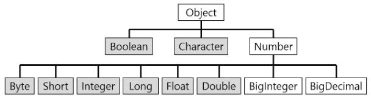

자바 변수의 유형
===
- 기본형(Primitive Type)
  - short
  - int
  - long
  - float
  - double
  - byte
  - char
  - boolean
- 참조형(Wrapper Class)
  - Short
  - Interger
  - Long
  - Float
  - Double
  - Byte
  - Character
  - Boolean

기본형(Primitvie Type)의 특징
===
- java.lang 패키지에 포함되어있다.
> https://docs.oracle.com/en/java/javase/11/docs/api/java.base/java/lang/package-summary.html
- 숫자(Number)의 자손
> https://docs.oracle.com/en/java/javase/11/docs/api/java.base/java/lang/Number.html
- 길이 값이 고정
  - 메모리의 효율적 사용이 가능하다.

참조형(Wrapper Class)의 특징
===
- java.lang 패키지에 포함되어있다.
> https://docs.oracle.com/en/java/javase/11/docs/api/java.base/java/lang/package-summary.html
- 객체(Object)의 자손
> https://docs.oracle.com/en/java/javase/11/docs/api/java.base/java/lang/Object.html
- 길이 값이 유동적
  - 메모리의 유연한 사용이 가능하다.
  - 메모리의 낭비가 발생할 수 있다.
- `메모리의 힙 영역(Heap)에 할당 후 사용된다.`
  - 참조형으로 선언된 변수에는 힙 영역의 주소가 할당된다.

참조형(Wrapper Class)의 구조도
---

> https://coding-factory.tistory.com/547